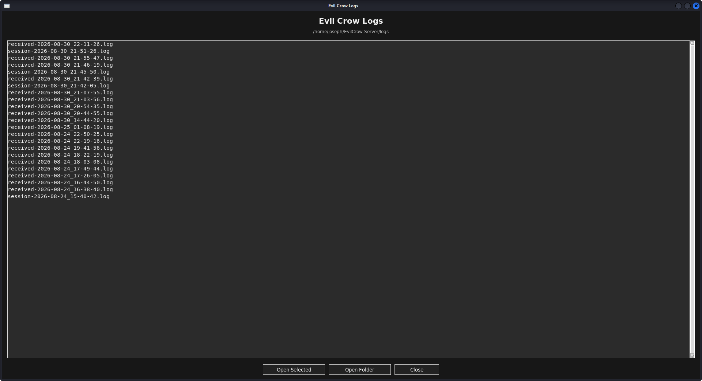
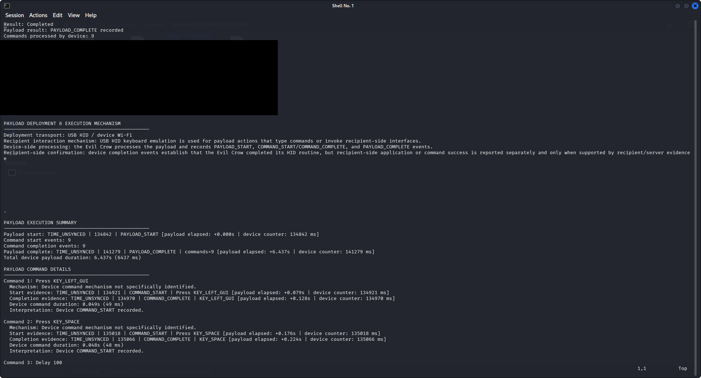
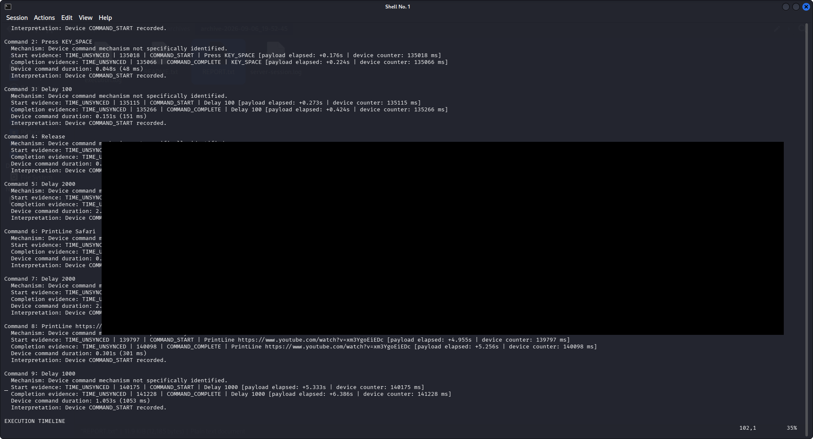
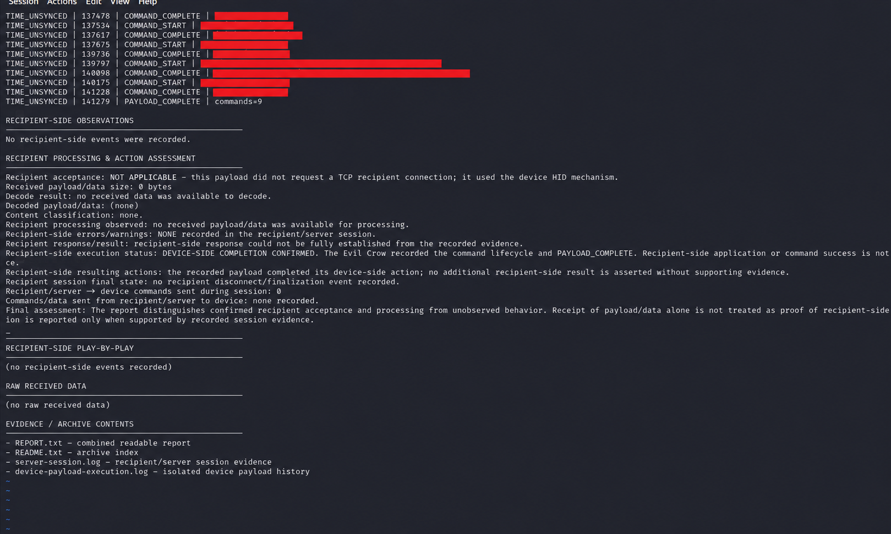
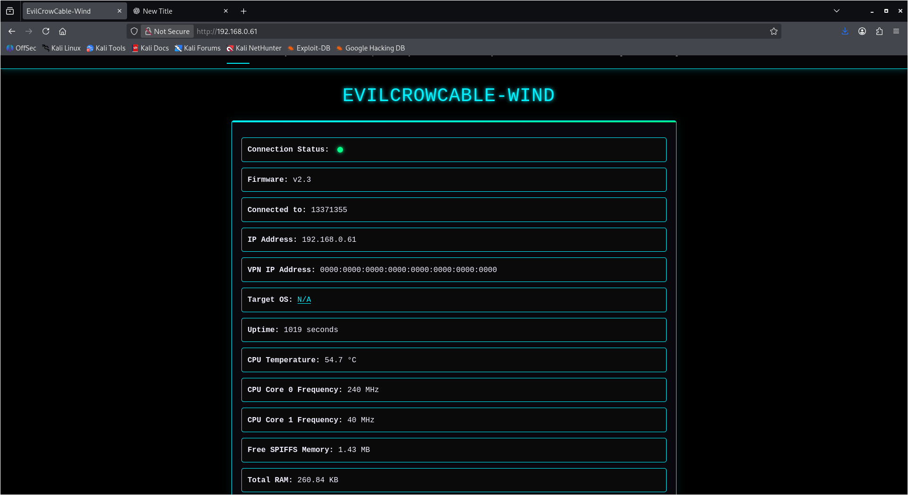

# Evil Crow Cable Wind — Reporting & Observability Showcase

This repository is a public showcase of reporting, observability, session-archiving, and desktop tooling work built around the **Evil Crow Cable Wind** project.

**Evil Crow Cable Wind was created by Joel Serna Moreno.** This repository is a separate public showcase of reporting, observability, session-archiving, and desktop tooling developed around the upstream **Evil Crow Cable Wind** project.

Joel Serna Moreno on GitHub: [joelsernamoreno](https://github.com/joelsernamoreno)

This showcase claims **no ownership** of Joel Serna Moreno's original Evil Crow Cable Wind project, firmware, original web interface, or other upstream work. Those components remain the work of **Joel Serna Moreno** and remain subject to the upstream project's original license and attribution requirements.

Original upstream project: [Joel Serna Moreno — Evil Crow Cable Wind](https://github.com/joelsernamoreno/EvilCrowCable-Wind)

## What this showcase adds

The focus of this repository is visibility into device activity and test sessions rather than publication of real-world payloads.

Highlights include:

- Timestamp-aware payload event logging on the device.
- Payload start, command start/completion, and payload completion events.
- Connection and server-session state reporting.
- Recipient-side execution/session information in archived reports.
- Session archiving and report generation.
- A desktop control-center launcher.
- A timestamped payload/session viewer.
- Separation of device, server, and reporting responsibilities.

### Visual walkthrough

#### Session Logs

<p align="center">
  
</p>

The logs view provides a simple way to browse recorded Evil Crow server and session activity.

#### Report Overview

<p align="center">
  
</p>

A generated session report summarizes the observed run context and captured reporting data. Environment-specific identifiers are redacted in this public screenshot.

#### Command and Timeline Detail

<p align="center">
  
</p>

The reporting layer reconstructs event order and command-level activity while preserving the distinction between device-side execution and observed recipient-side evidence. Sensitive test content is redacted from the public screenshot.

#### Final Assessment

<p align="center">
  
</p>

The final report section presents evidence classifications, recipient-side assessment, and a concise summary of what was actually observed during the session.

## Public-source scope

This repository intentionally contains a curated subset of the larger development environment.

Included:

- Firmware source required for the public observability showcase.
- Server-side session and reporting components.
- Desktop viewing/control tooling.
- Documentation and examples added specifically for public presentation.

Excluded:

- Real payloads used during private testing.
- Private test history and session archives.
- Device MAC addresses and private network addresses.
- Credentials and local configuration.
- Development backups and checkpoints.
- Build artifacts and locally generated runtime data.

The public source may contain generic references to payload commands where required by the upstream application architecture, but real tested payload content is not published here.

## Project structure

```text
firmware/
  firmware.ino
  *.h

server/
  evilcrow-server.py
  evilcrow-master.sh
  archive_session.py

desktop/
  evilcrow-control-center.py
  payload-viewer.py

docs/
  images/

examples/

```

## Reporting workflow

At a high level, the reporting workflow is:

```text
Evil Crow device
      |
      v
payload/event logging
      |
      v
Evil Crow server
      |
      v
session collection
      |
      v
archive + report generation
      |
      v
desktop viewing / review
```
The reporting layer is designed to preserve event ordering and provide a readable record of what was observed during an authorized test session.

## Device Web Interface

The **Evil Crow Cable Wind web interface** shown below originates from the upstream **Evil Crow Cable Wind** project created by **Joel Serna Moreno**. The original implementation, firmware, and web interface are part of Joel Serna Moreno's upstream project; this showcase does not claim ownership of them.

The Evil Crow Cable Wind web interface is served locally by each individual Evil Crow device. It is not a single static page containing identical values for every user. What appears in the interface reflects the configuration and current runtime state of that particular device and environment.

For that reason, information such as the connected Wi-Fi network, device IP address, VPN IP address, uptime, CPU temperature, memory statistics, connection state, and other runtime values can differ from one user, device, network, or session to another.

The screenshot below shows the Evil Crow Cable Wind web interface as it appeared in this project's authorized lab environment. Network-specific and environment-specific values have been deliberately redacted before publication.

For the original Evil Crow Cable Wind web interface, firmware, documentation, and upstream implementation, see **Joel Serna Moreno's original project**:

[Joel Serna Moreno — Evil Crow Cable Wind](https://github.com/joelsernamoreno/EvilCrowCable-Wind)



## Privacy and safety

Do not commit:

- credentials,
- private IP addresses,
- hardware identifiers,
- live session logs,
- real payloads,
- private archives,
- personal development backups,
- or other environment-specific information.

Use this project only with hardware, systems, networks, and recipients for which you have explicit authorization.

## Upstream project

This showcase is built around the original **Evil Crow Cable Wind** project created by **Joel Serna Moreno**.

**Original creator:** Joel Serna Moreno  
**Original upstream project:** [Evil Crow Cable Wind](https://github.com/joelsernamoreno/EvilCrowCable-Wind)

Useful upstream resources:

- [Joel Serna Moreno's original Evil Crow Cable Wind repository](https://github.com/joelsernamoreno/EvilCrowCable-Wind)
- [Upstream repository history and releases](https://github.com/joelsernamoreno/EvilCrowCable-Wind/releases)
- [Upstream project issues](https://github.com/joelsernamoreno/EvilCrowCable-Wind/issues)

The upstream **Evil Crow Cable Wind** project, its original firmware, its original web interface, and other upstream-derived components are credited to **Joel Serna Moreno**. This repository claims **no ownership** of those original upstream works.

This repository should be understood as a separate showcase of development, testing, reporting, observability, session-archiving, and desktop-integration work built around the upstream project. It is not a replacement for the original Evil Crow Cable Wind repository and should not be interpreted as claiming authorship or ownership of Joel Serna Moreno's work.

The upstream project identifies **Evil Crow Cable Wind © 2024 by Joel Serna Moreno** as licensed under **CC BY-NC-SA 4.0**. Upstream-derived material in this showcase remains subject to the original project's licensing and attribution requirements.

## License

Upstream-derived material remains subject to the license provided by the original project.

Before redistributing or modifying upstream-derived files, review the upstream repository's current license and attribution requirements.

## Status

This repository is a curated public showcase. Private development material and real testing artifacts are intentionally kept outside the repository.
