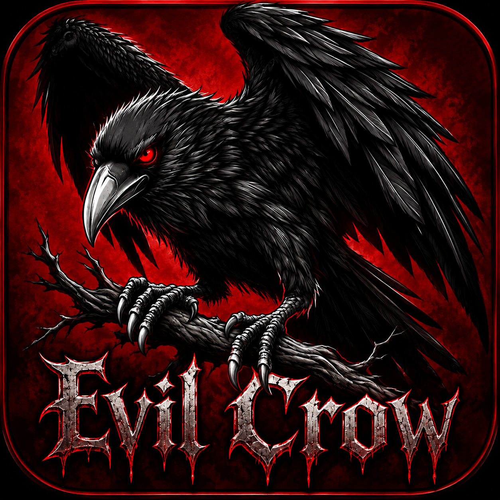
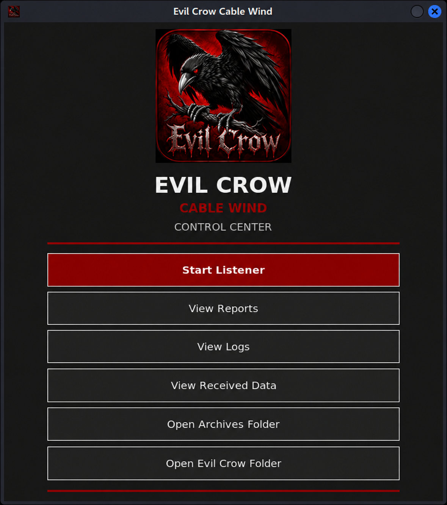

# Evil Crow Cable Wind — Reporting & Observability Showcase

<p align="center">
  
</p>


This repository is a public showcase of reporting, observability, session-archiving, and desktop tooling work built around the **Evil Crow Cable Wind** project.

The original Evil Crow Cable Wind project and its firmware are by **Joel Serna Moreno**. This repository does not claim ownership of the upstream project. Upstream-derived components remain subject to their original license and attribution requirements.

## What this showcase adds

The focus of this repository is visibility into device activity and test sessions rather than publication of real-world payloads.

Highlights include:

- Timestamp-aware payload event logging on the device.
- Payload start, command start/completion, and payload completion events.
- Connection and server-session state reporting.
- Recipient-side execution/session information in archived reports.
- Session archiving and report generation.
- A desktop control-center launcher.
- A timestamped payload/session viewer.
- Separation of device, server, and reporting responsibilities.

### Evil Crow Control Center

<p align="center">
  
</p>

The desktop control center provides a graphical entry point for launching and reviewing the Evil Crow Cable Wind reporting environment.

### Visual walkthrough

#### Session Logs

<p align="center">
  
</p>

The logs view provides a simple way to browse recorded Evil Crow server and session activity.

#### Report Overview

<p align="center">
  
</p>

A generated session report summarizes the observed run context and captured reporting data. Environment-specific identifiers are redacted in this public screenshot.

#### Command and Timeline Detail

<p align="center">
  
</p>

The reporting layer reconstructs event order and command-level activity while preserving the distinction between device-side execution and observed recipient-side evidence. Sensitive test content is redacted from the public screenshot.

#### Final Assessment

<p align="center">
  
</p>

The final report section presents evidence classifications, recipient-side assessment, and a concise summary of what was actually observed during the session.

## Public-source scope

This repository intentionally contains a curated subset of the larger development environment.

Included:

- Firmware source required for the public observability showcase.
- Server-side session and reporting components.
- Desktop viewing/control tooling.
- Documentation and examples added specifically for public presentation.

Excluded:

- Real payloads used during private testing.
- Private test history and session archives.
- Device MAC addresses and private network addresses.
- Credentials and local configuration.
- Development backups and checkpoints.
- Build artifacts and locally generated runtime data.

The public source may contain generic references to payload commands where required by the upstream application architecture, but real tested payload content is not published here.

## Project structure

```text
firmware/
  firmware.ino
  *.h

server/
  evilcrow-server.py
  evilcrow-master.sh
  archive_session.py

desktop/
  evilcrow-control-center.py
  payload-viewer.py

docs/
  images/

examples/

```

## Reporting workflow

At a high level, the reporting workflow is:

```text
Evil Crow device
      |
      v
payload/event logging
      |
      v
Evil Crow server
      |
      v
session collection
      |
      v
archive + report generation
      |
      v
desktop viewing / review
```
The reporting layer is designed to preserve event ordering and provide a readable record of what was observed during an authorized test session.

## Privacy and safety

Do not commit:

- credentials,
- private IP addresses,
- hardware identifiers,
- live session logs,
- real payloads,
- private archives,
- personal development backups,
- or other environment-specific information.

Use this project only with hardware, systems, networks, and recipients for which you have explicit authorization.

## Upstream project

This showcase is based on the original [Evil Crow Cable Wind project](https://github.com/joelsernamoreno/EvilCrow-Cable-Wind) by **Joel Serna Moreno**.

Useful upstream resources:

- [Original Evil Crow Cable Wind repository](https://github.com/joelsernamoreno/EvilCrow-Cable-Wind)
- [Upstream repository history and releases](https://github.com/joelsernamoreno/EvilCrow-Cable-Wind/releases)
- [Upstream project issues](https://github.com/joelsernamoreno/EvilCrow-Cable-Wind/issues)

This showcase should be read as a separate presentation of development and observability work around that project, not as a replacement for or claim of ownership over the upstream project.


## License

Upstream-derived material remains subject to the license provided by the original project.

Before redistributing or modifying upstream-derived files, review the upstream repository's current license and attribution requirements.

## Status

This repository is a curated public showcase. Private development material and real testing artifacts are intentionally kept outside the repository.
